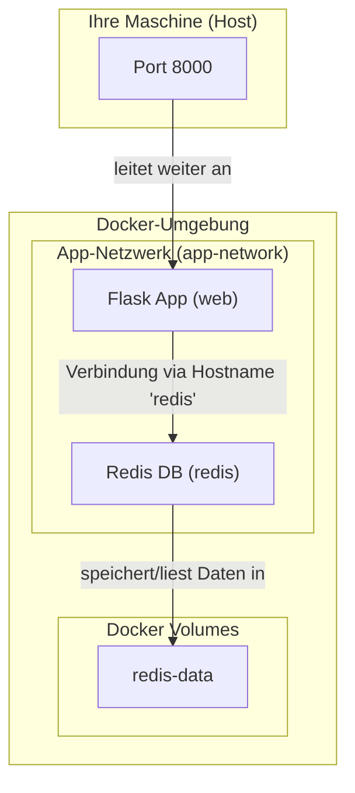

# Docker-lsg: Ein Dockerized Flask & Redis Counter

[](https://www.python.org/)
[](https://flask.palletsprojects.com/)
[](https://redis.io/)
[](https://www.docker.com/)

Eine robuste Vorlage für eine Webanwendung, die eine **Python Flask**-Anwendung mit einer **Redis**-Datenbank kombiniert und vollständig über **Docker Compose** orchestriert wird.

Dieses Projekt dient als Blaupause für moderne Web-Services und demonstriert Best Practices in den Bereichen Containerisierung, Konfiguration und Anwendungsstruktur.

## Architektur-Übersicht

Die Anwendung besteht aus zwei Hauptdiensten, die in einem dedizierten Docker-Netzwerk miteinander kommunizieren. Die Redis-Daten werden mithilfe eines benannten Docker-Volumes persistent gespeichert.



## Voraussetzungen

Stellen Sie sicher, dass die folgenden Werkzeuge auf Ihrem System installiert sind:

*   [Docker](https://docs.docker.com/get-docker/)
*   [Docker Compose](https://docs.docker.com/compose/install/) (ist in der Regel in Docker Desktop enthalten)

## Schnellstart

1.  **Repository klonen:**
    ```sh
    git clone https://github.com/berndkaliwes-ai/Docker-lsg.git
    cd Docker-lsg
    ```

2.  **Anwendung starten:**
    Verwenden Sie Docker Compose, um die Images zu bauen und die Container zu starten.
    ```sh
    docker-compose up --build
    ```
    Der `--build`-Flag stellt sicher, dass das Docker-Image neu gebaut wird, falls Sie Änderungen am `Dockerfile` oder am Code vorgenommen haben.

3.  **Anwendung aufrufen:**
    Öffnen Sie Ihren Webbrowser und besuchen Sie [http://localhost:8000](http://localhost:8000). Bei jedem Neuladen der Seite sollte der Zähler um eins erhöht werden.

## Konfiguration

Die Anwendung wird über Umgebungsvariablen konfiguriert, die in der `docker-compose.yml` gesetzt werden können. Dies folgt den [12-Factor App](https://12factor.net/config)-Prinzipien.

| Variable | Beschreibung | Standardwert |
| :--- | :--- | :--- |
| `FLASK_ENV` | Legt die Flask-Umgebung fest (`development` oder `production`). | `development` |
| `REDIS_HOST`| Der Hostname des Redis-Dienstes im Docker-Netzwerk. | `redis` |
| `REDIS_PORT`| Der Port, auf dem der Redis-Dienst lauscht. | `6379` |

## Nützliche Docker-Befehle

*   **Anwendung im Hintergrund starten:**
    ```sh
    docker-compose up -d
    ```

*   **Anwendung anhalten und Container entfernen:**
    ```sh
    docker-compose down
    ```

*   **Logs der Anwendung ansehen:**
    ```sh
    docker-compose logs -f web
    ```

*   **Eine Shell im Web-Container öffnen:**
    ```sh
    docker-compose exec web /bin/bash
    ```

## Lizenz

Dieses Projekt steht unter der MIT-Lizenz. Es wird empfohlen, eine `LICENSE`-Datei zum Repository hinzuzufügen.

---

### Zusammenfassung der Dokumentations-Verbesserungen

*   **Professionalität:** Das Projekt sieht sofort seriös und gut gewartet aus, dank der Badges und der klaren Struktur.
*   **Klarheit:** Jeder, der das Repository findet, weiß sofort, was es tut und wie die Architektur aussieht (dank der Mermaid-Grafik).
*   **Benutzerfreundlichkeit:** Die "Schnellstart"-Anleitung ist unmissverständlich und erlaubt es jedem, Ihre Anwendung innerhalb von Minuten zum Laufen zu bringen.
*   **Wartbarkeit:** Die Abschnitte "Konfiguration" und "Nützliche Befehle" sind eine enorme Hilfe für die zukünftige Entwicklung und das Debugging.

Damit haben wir das gesamte Repository – vom Code über die Infrastruktur bis zur Dokumentation – auf ein professionelles Niveau gehoben.